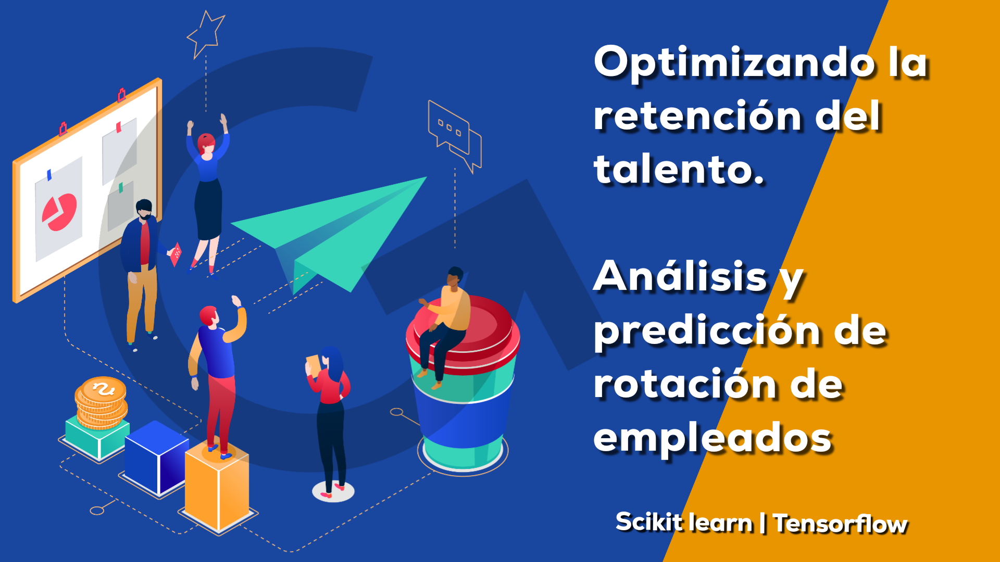
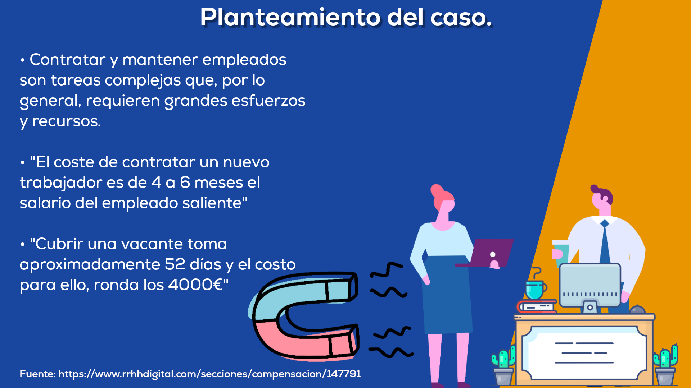

## Human Resources-Analytics / Rotacion de empleados

La alta rotación de empleados supone **grandes perdidas para las empresas**, no se trata solo del dinero, sino de la incapacidad de retener el talento y tener que dedicar esfuerzos constantes a integrar nuevas personas en el equipo, además que reemplazar empleados de alto nivel suele ser una tarea ardua y costosa.

Para desglosar un poco la imagen, podemos decir que los costos incluyen:

- Costo de baja
- Costo de contratación (publicidad, entrevistas, contratación)
- Coste de incorporación de una nueva persona (formación, tiempo de gestión)
- Pérdida de productividad (una persona nueva puede tardar entre 1 y 2 años en alcanzar la productividad de una persona existente)

En este análisis vamos a hechar un vistazo al dataset de **IBM HR Analytics Employee Attrition & Performance**, que consta de 1470 registros de empelados de una compañia y recoge 35 caracteristicas para cada uno, 237 de esos datos son de Ex-empleados, ya han dejado la empresa y nuestro objetivo es tratar de **averiguar cuales son los puntos débiles de nuestro sistema de RRHH** y por qué estos empelados se estan yendo. Queremos detectar esas necesidades o puntos en los cuales el trabajador no se siente contento.

## Objetivos
- Comprender qué factores contribuyen más a la rotación de empleados.
- Agrupar y clasificar para encontrar patrones significativos de características de los empleados.
- Crear un modelo que prediga si un determinado empleado abandonará la empresa o no.
- Crear y mejorar las estrategias de retenciónd e empleados.
- Que la gerencia y el Departamento de RRHH tenga informacion solida para mejorar la toma de decisiones.

## Desglose del caso.

En el [notebook de este repositorio](https://github.com/ricardobrein/HR-Analytics-Rotacion-de-empleados/blob/main/Notebook-employee-retention-and-prediction.ipynb) está todo el código que avanza en diferentes pasos a medida que iba abordando el problema.
 
1. El EDA revisando los datos a ver que logramos conseguir y además gráficamente, vamos a mirar si encontramos algunos patrones o generalidades en ambos grupos
2. Continuaremos con la prueba de 3 modelos de clasificación para este tipo de situaciones donde lo que queremos conseguir es una probabilidad u otra (Random Forest, Regresion Logística, Xgboost), por otra parte tambien crearemos una red neuronal con tensorflow Para clasificar y evaluaremos el rendimiento con la **matriz de confusión** y veremos cuales modelos nos dan los mejores resultados de f1, precision, sensibilidad, etc.
3. Sabiendo que lso datos están desbalanceados por lo cual tenderla a predecir mejor la clase mayoritária, vamos a aplciar oversampling con SMOTE, para igualar ambas clases y crearemos los modelos nuevamente.
4. Evaluaremos el rendimiento del modelo con las pricnipales medidas en problemas de clasificación.

Ya que estamos montados en el carro, vamos a crear una **red neuronal sencilla con la API sequential de Tensorflow.** sera una red por capas, que tendra algunas capas densas y funcion de activación ReLU y sigmoid. en el notebook esta todo.

Al final de el notebook se me ocurrio **eliminar más caracteristicas de los datos** ya que después de la limpieza básica me habian quedado 26, utilice el modulo de sklearn Recursive Feature Elimination, y seleccione las 15 carácteristicas principales, lo cual, aparte de reducir la complejidad del modelo, nos daría una visión más amplia de cuales podrían ser las preocupaciones principales de los empleados quen han abandona o que estan por hacerlo.

[JupyterNotebook completo](https://github.com/ricardobrein/HR-Analytics-Rotacion-de-empleados/blob/main/Notebook-employee-retention-and-prediction.ipynb)

 Gracias por leer, hasta la proxima. 🙋‍♂️

 ### Referencias y agradecimientos:
- **Dataset:** https://www.kaggle.com/datasets/pavansubhasht/ibm-hr-analytics-attrition-dataset
- **Lecturas** https://www.academia.edu/download/63206732/00-Guide-intellisys-employee20200505-127995-13vhqr8.pdf
- **Matriz de confusion** https://empresas.blogthinkbig.com/como-interpretar-la-matriz-de-confusion-ejemplo-practico/
